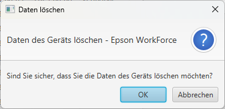

# JavaFXDesktopApp

Ein Programm zur speicherung des Status eines Gerätes und zum Ausleihen von Geräten

Inhalte der Tabellen wird ohne korrekten Login, nicht geladen!

Nach korrekten Login wird die Tabelle freigegeben.

Wenn ein Gerät "Verfügbar" ist, kann man es durch ein Anklicken "Mieten" (Mit zeitangabe von bis).

Wenn ein Gerät "Ausgeliehen" ist, kann man es durch einen Anklick und darauf folgenden Dialog zurücksetzen.