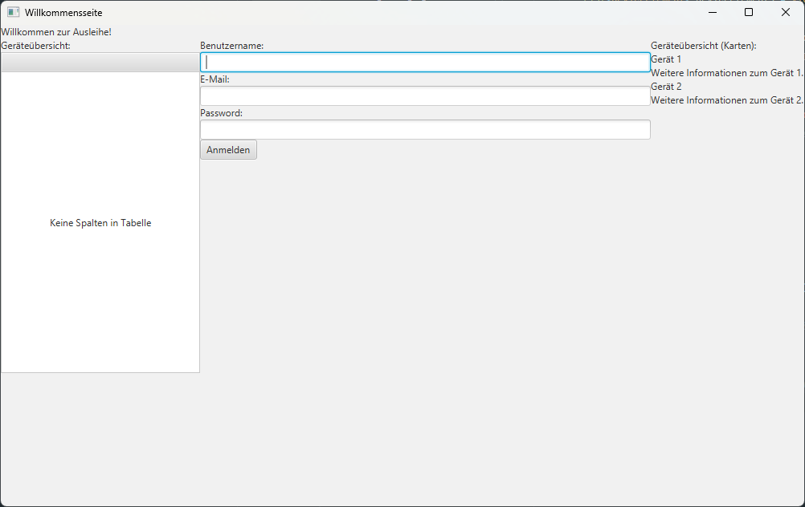
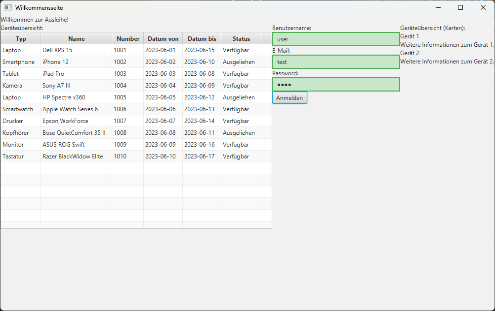
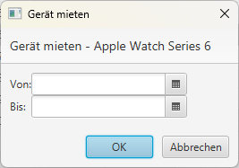

# JavaFXDesktopApp

Ein Programm zur speicherung vom Status eines Gerätes und zum Ausleihen von Geräten

Inhalte der Tabellen wird ohne korrekten Login, nicht geladen!

Nach korrekten Login wird die Tabelle freigegeben.

Wenn ein Gerät "Verfügbar" ist, kann man es durch ein Anklicken "Mieten" (Mit zeitangabe von bis).